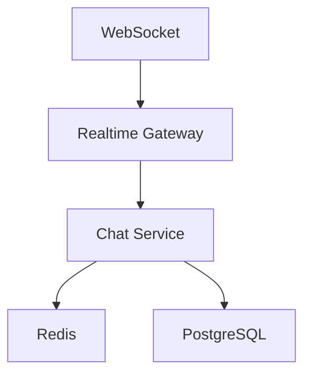
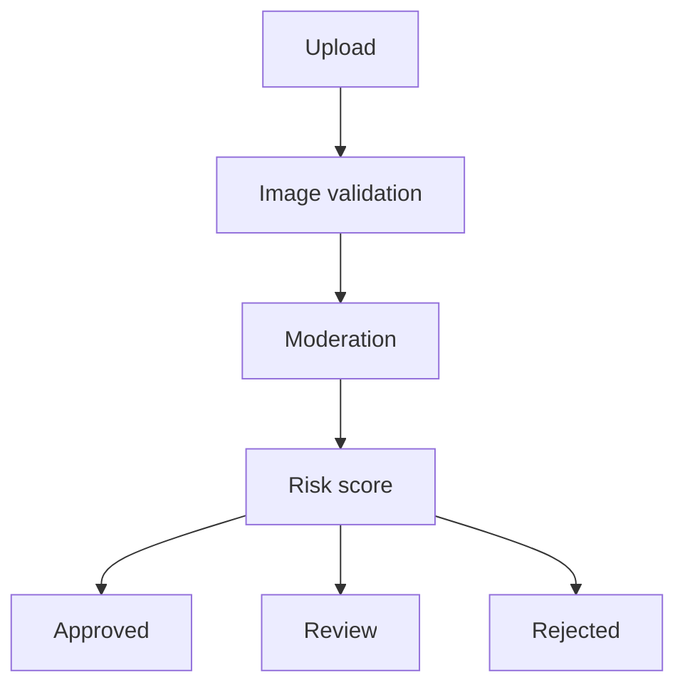
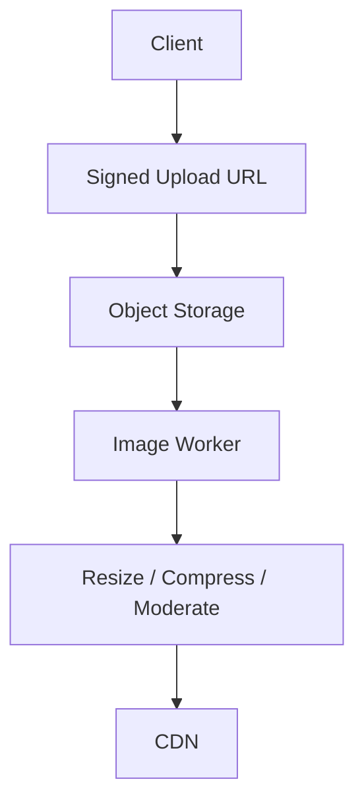
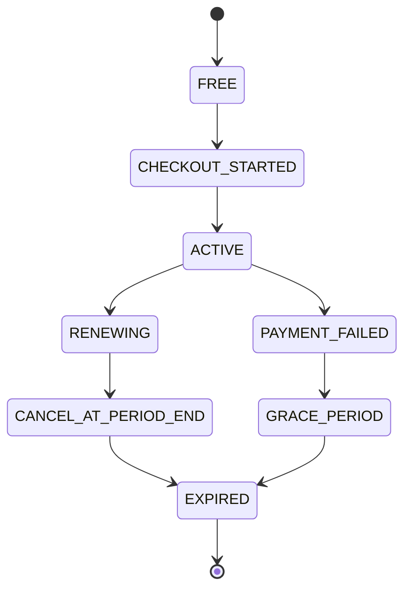

# Dating Platform — Product & Technical Specification

> **Amaç:** Tinder / Bumble benzeri, ancak daha modern, premium ve ölçeklenebilir bir tanışma uygulamasını Cursor ile uçtan uca geliştirmek.
>
> **Durum:** Greenfield / production-ready architecture
>
> **Dil:** Türkçe
>
> **Hedef:** Web + PWA ile başlayıp gerektiğinde React Native mobil uygulamaya genişleyebilecek sağlam bir backend ve ürün altyapısı.

---

## İçindekiler

1. [Görsel Kimlik](#1-görsel-kimlik)
2. [Ürün Vizyonu](#2-ürün-vizyonu)
3. [Ürün Prensipleri](#3-ürün-prensipleri)
4. [Kullanıcı Rolleri](#4-kullanıcı-rolleri)
5. [Ana Sayfalar](#5-ana-sayfalar)
6. [Authentication](#6-authentication)
7. [Kullanıcı Profili](#7-kullanıcı-profili)
8. [Discovery / Swipe Sistemi](#8-discovery--swipe-sistemi)
9. [Match Sistemi](#9-match-sistemi)
10. [Chat](#10-chat)
11. [Subscription / Monetization](#11-subscription--monetization)
12. [Subscription Data Model](#12-subscription-data-model)
13. [Ödeme Sistemi](#13-ödeme-sistemi)
14. [Paket Limit Sistemi](#14-paket-limit-sistemi)
15. [Boost Sistemi](#15-boost-sistemi)
16. [Super Like](#16-super-like)
17. [Recommendation Engine](#17-recommendation-engine)
18. [Database](#18-database)
19. [Redis](#19-redis)
20. [Event Architecture](#20-event-architecture)
21. [Bildirimler](#21-bildirimler)
22. [Moderasyon ve Güvenlik](#22-moderasyon-ve-güvenlik)
23. [Yaş Güvenliği](#23-yaş-güvenliği)
24. [Fotoğraf Sistemi](#24-fotoğraf-sistemi)
25. [API Architecture](#25-api-architecture)
26. [Önerilen Stack](#26-önerilen-stack)
27. [Monorepo](#27-monorepo)
28. [API Standartları](#28-api-standartları)
29. [Idempotency](#29-idempotency)
30. [Rate Limiting](#30-rate-limiting)
31. [Analytics](#31-analytics)
32. [Admin Dashboard](#32-admin-dashboard)
33. [Feature Flags](#33-feature-flags)
34. [SEO](#34-seo)
35. [UX / Swipe Animasyonu](#35-ux--swipe-animasyonu)
36. [Offline / Network Hataları](#36-offline--network-hataları)
37. [Empty States](#37-empty-states)
38. [Paywall UX](#38-paywall-ux)
39. [Subscription Lifecycle](#39-subscription-lifecycle)
40. [Account Deletion](#40-account-deletion)
41. [Privacy](#41-privacy)
42. [Security Checklist](#42-security-checklist)
43. [Testing](#43-testing)
44. [CI/CD](#44-cicd)
45. [Environment Variables](#45-environment-variables)
46. [Cursor Development Rules](#46-cursor-development-rules)
47. [Cursor Agent Workflow](#47-cursor-agent-workflow)
48. [İlk MVP Sırası](#48-i̇lk-mvp-sırası)
49. [V1’de Yapılmaması Gerekenler](#49-v1de-yapılmaması-gerekenler)
50. [Production Architecture](#50-production-architecture)
51. [Definition of Done](#51-definition-of-done)
52. [En Önemli Teknik Kararlar](#52-en-önemli-teknik-kararlar)
53. [Sonuç](#53-sonuç)

---

## 1. Görsel Kimlik

Referans görseldeki mor/pembe atmosfer temel alınacaktır.

### Renk paleti

| Token | HEX | Kullanım |
| --- | --- | --- |
| `--color-primary` | `#B99BFB` | Ana mor/pembe accent |
| `--color-primary-strong` | `#9C7AF2` | Hover, active, CTA |
| `--color-primary-soft` | `#D8C8FF` | Soft arka plan / badge |
| `--color-bg-top` | `#645387` | Üst gradient tonu |
| `--color-bg-mid` | `#3E354F` | Orta ton |
| `--color-bg-bottom` | `#17151B` | Koyu ana arka plan |
| `--color-surface` | `#211E27` | Kart / panel |
| `--color-surface-2` | `#2B2733` | İkincil panel |
| `--color-text` | `#FFFFFF` | Ana metin |
| `--color-text-muted` | `#AAA5B5` | İkincil metin |
| `--color-success` | `#35D07F` | Like / başarı |
| `--color-danger` | `#FF5C7A` | Pass / hata |
| `--color-warning` | `#FFC857` | Uyarı |

### Ana gradient

```css
background:
  linear-gradient(
    180deg,
    #645387 0%,
    #3E354F 42%,
    #17151B 100%
  );
```

Accent için:

```css
background: linear-gradient(135deg, #B99BFB 0%, #8E6DE8 100%);
```

> Renkler referans ekran görüntüsündeki mor/lila atmosferden türetilmiştir. Uygulamada renkler hard-code edilmemeli; design token olarak tutulmalıdır.

---

## 2. Ürün Vizyonu

Uygulama, kullanıcıların profil oluşturarak konum, yaş, ilgi alanları ve tercihleri üzerinden yeni insanlarla tanışmasını sağlayan premium bir dating platformudur.

### Temel deneyim

- [x] 1. Kayıt ol
- [x] 2. Profilini oluştur
- [x] 3. Tercihlerini belirle
- [x] 4. Discovery ekranında profilleri gör
- [x] 5. Sağ/sol kaydır
- [x] 6. Karşılıklı like = Match
- [x] 7. Match sonrası chat
- [x] 8. Premium özelliklerle daha fazla keşfet
- [x] 9. Güvenlik ve moderasyon sistemiyle güvenli iletişim kur

---

## 3. Ürün Prensipleri

- [x] Mobile-first
- [x] Hızlı ve akıcı swipe deneyimi
- [x] Premium his veren dark UI
- [x] Minimal ama güçlü animasyonlar
- [x] Privacy-first
- [x] Abuse/fraud prevention
- [x] Subscription-first monetization
- [x] Ölçeklenebilir backend
- [x] Modüler monorepo
- [x] Type-safe frontend/backend
- [x] Event-driven yapı
- [x] Production-ready observability

---

## 4. Kullanıcı Rolleri

### Guest

- [x] Landing page
- [x] Uygulama özelliklerini görme
- [x] Fiyatlandırma
- [x] Login/register

### User

- [x] Profil
- [x] Discovery
- [x] Like / Pass
- [x] Match
- [x] Chat
- [x] Bildirimler
- [x] Ayarlar
- [x] Report / Block

### Premium User

- [x] Paketine göre artırılmış swipe
- [x] Rewind
- [x] Super Like / özel beğeni
- [x] Daha fazla görünürlük
- [x] Gelişmiş filtreler
- [x] Beğenenleri görme
- [x] Incognito
- [x] Passport / location değiştirme

### Moderator

- [x] Report inceleme
- [x] Kullanıcı moderasyonu
- [x] Fotoğraf moderasyonu
- [x] Mesaj/report yönetimi

### Admin

- [x] Kullanıcı yönetimi
- [x] Subscription yönetimi
- [x] Paket yönetimi
- [x] Moderasyon
- [x] Analytics
- [x] Revenue
- [x] Feature flags
- [x] Audit logs

---

## 5. Ana Sayfalar

### Public

- [x] `/`
- [x] `/about`
- [x] `/how-it-works`
- [x] `/pricing`
- [x] `/safety`
- [x] `/community-guidelines`
- [x] `/terms`
- [x] `/privacy`
- [x] `/contact`

### Auth

- [x] `/login`
- [x] `/register`
- [x] `/verify-email`
- [x] `/forgot-password`
- [x] `/reset-password`

### Onboarding

- [x] `/onboarding`
- [x] `/onboarding/profile`
- [x] `/onboarding/photos`
- [x] `/onboarding/preferences`
- [x] `/onboarding/location`

### Application

- [x] `/discover`
- [x] `/likes`
- [x] `/matches`
- [x] `/matches/:matchId`
- [x] `/profile`
- [x] `/profile/:username`
- [x] `/settings`
- [x] `/notifications`
- [x] `/subscription`

### Admin

- [x] `/admin`
- [x] `/admin/users`
- [x] `/admin/reports`
- [x] `/admin/subscriptions`
- [x] `/admin/payments`
- [x] `/admin/analytics`
- [x] `/admin/moderation`
- [x] `/admin/settings`

---

## 6. Authentication

### Desteklenecek yöntemler

- [x] Email + password
- [x] Email verification
- [x] Google OAuth
- [ ] Apple Sign In (mobil uygulamada)
- [x] Refresh token
- [x] Access token
- [x] Session management
- [x] Device/session tracking
- [x] Logout all sessions

### Güvenlik

- [x] Argon2id veya bcrypt
- [x] Rate limiting
- [x] Login attempt protection
- [x] CSRF protection gerektiği yerde
- [x] Secure cookies
- [x] JWT rotation
- [x] Refresh token rotation
- [x] Email verification
- [ ] Suspicious login detection

---

## 7. Kullanıcı Profili

### Temel bilgiler

- [x] First name
- [x] Username
- [x] Birth date
- [x] Gender
- [x] Interested in
- [x] Bio
- [x] City
- [x] Country
- [x] Occupation
- [x] Education
- [x] Height (opsiyonel)
- [x] Languages

### Profil özellikleri

- [x] 1 ana profil fotoğrafı
- [x] Çoklu fotoğraf
- [ ] Video/intro opsiyonu
- [x] Interests
- [x] Lifestyle
- [x] Relationship intention
- [x] Verification status

### Profil sıralaması

Profil discovery algoritması için:

- [x] Distance
- [x] Age compatibility
- [x] Preference compatibility
- [x] Activity score
- [x] Profile completeness
- [x] Recent activity
- [x] Like/pass history
- [x] Report/fraud signals
- [x] Premium visibility boosts

---

## 8. Discovery / Swipe Sistemi

Discovery ekranı uygulamanın ana ekranıdır.

### Her kart

- [x] Fotoğraf
- [x] İsim
- [x] Yaş
- [x] Mesafe
- [x] Bio
- [x] Ortak ilgi alanları
- [x] Verification badge
- [x] Profil detayları

### Aksiyonlar

- [x] Swipe Left = Pass
- [x] Swipe Right = Like
- [x] Super Like
- [x] Rewind
- [x] Open profile

### Swipe transaction mantığı

Her swipe backend tarafından kaydedilir.

```text
Swipe
├── id
├── actorUserId
├── targetUserId
├── action
├── createdAt
└── metadata
```

`action`:

```text
LIKE
PASS
SUPER_LIKE
```

- [x] Aynı kullanıcıya tekrar swipe yapılmasını önlemek için unique constraint / idempotency uygulanmalıdır.

---

## 9. Match Sistemi

Bir kullanıcı A’yı like ettiğinde:

```text
A -> LIKE -> B
```

ve B daha önce A’yı like etmişse:

```text
A <-> B
```

Match oluşturulur.

### Match modeli

```text
Match
├── id
├── userAId
├── userBId
├── createdAt
├── lastMessageAt
├── status
└── expiresAt
```

### Match event

```text
MATCH_CREATED
```

Bu event şunlar tarafından tüketilebilir:

- [x] Notification
- [x] Push notification
- [x] Analytics
- [ ] Recommendation system

---

## 10. Chat

Match sonrası mesajlaşma açılır.

### Özellikler

- [x] Text message
- [x] Image message
- [x] Read receipt
- [x] Typing indicator
- [x] Online status
- [x] Message timestamps
- [x] Delete message
- [x] Report message
- [x] Block user

### Teknik

```text
WebSocket
    ↓
Realtime Gateway
    ↓
Chat Service
    ↓
Redis
    ↓
PostgreSQL
```



- [x] Mesajlar kalıcı olarak PostgreSQL’de tutulmalıdır.
- [x] Redis yalnızca realtime/presence/cache gibi alanlarda kullanılmalıdır.

---

## 11. Subscription / Monetization

Monetizasyonun temel yapısı aylık ve yıllık aboneliklerdir.

Örnek paket sistemi:

### Free

- [x] Günlük sınırlı Like
- [x] Temel filtreler
- [x] Match
- [x] Chat
- [x] Profil oluşturma

### Plus

Örnek:

- [x] Daha yüksek günlük Like limiti
- [x] Rewind
- [x] Super Like
- [x] Gelişmiş filtreler
- [x] Reklamsız deneyim
- [x] Daha fazla görünürlük

### Premium

Örnek:

- [x] Çok yüksek / sınırsız Like politikası
- [x] Beğenenleri gör
- [x] Rewind
- [x] Super Like
- [x] Boost
- [x] Incognito
- [x] Passport
- [x] Gelişmiş filtreler
- [x] Öncelikli görünürlük

> Paket limitleri database üzerinden yönetilmelidir. Kod içine sabit olarak gömülmemelidir.

---

## 12. Subscription Data Model

```text
SubscriptionPlan
├── id
├── name
├── slug
├── description
├── monthlyPrice
├── yearlyPrice
├── currency
├── features
├── swipeLimit
├── superLikeLimit
├── boostLimit
├── rewindEnabled
├── seeLikesEnabled
├── incognitoEnabled
├── passportEnabled
├── active
├── createdAt
└── updatedAt
```

Kullanıcı aboneliği:

```text
Subscription
├── id
├── userId
├── planId
├── provider
├── providerSubscriptionId
├── status
├── currentPeriodStart
├── currentPeriodEnd
├── cancelAtPeriodEnd
├── createdAt
└── updatedAt
```

- [x] `SubscriptionPlan` modeli
- [x] `Subscription` modeli

---

## 13. Ödeme Sistemi

Ödeme sağlayıcısı abstraction ile geliştirilmelidir.

Örneğin:

```text
PaymentProvider
├── createCustomer()
├── createCheckout()
├── createSubscription()
├── cancelSubscription()
├── refund()
├── verifyWebhook()
└── getSubscription()
```

Böylece sağlayıcı değişirse bütün sistemi yeniden yazmak gerekmez.

### Türkiye için

- [x] Yerel ödeme sağlayıcısı
- [ ] 3D Secure
- [x] TRY
- [ ] iyzico / PayTR benzeri provider

### Global için

- [ ] Stripe
- [ ] Apple App Store
- [ ] Google Play Billing

desteklenebilir.

### Kritik kural

Client tarafından `"user paid"` gibi bir bilgiye kesinlikle güvenilmemelidir.

Ödeme durumu yalnızca şu akışla güncellenmelidir:

```text
Payment Provider
        ↓
Verified Webhook
        ↓
Backend
        ↓
Subscription
```

- [x] Ödeme durumu yalnızca verified webhook akışıyla güncelleniyor
- [x] Webhook signature mutlaka doğrulanmalıdır.

---

## 14. Paket Limit Sistemi

Limitler merkezi bir service üzerinden yönetilir.

Örnek:

```ts
SwipeService.canSwipe(userId)
```

### Kontrol

- [x] 1. Active subscription var mı?
- [x] 2. Plan nedir?
- [x] 3. Günlük/period limiti nedir?
- [x] 4. Kullanıcı kaç swipe yaptı?
- [x] 5. Limit dolmuş mu?
- [x] 6. Feature override var mı?

Örnek response:

```json
{
  "allowed": true,
  "remaining": 47,
  "resetAt": "2026-10-07T00:00:00Z"
}
```

---

## 15. Boost Sistemi

Kullanıcı belirli süre daha fazla kişiye gösterilebilir.

Örneğin:

```text
BOOST_30_MIN
BOOST_60_MIN
```

### Boost aktivasyonu

```text
User
 ↓
Purchase
 ↓
Boost inventory
 ↓
Activate
 ↓
Recommendation ranking multiplier
```

- [x] Boost state database’de tutulmalıdır.

---

## 16. Super Like

Super Like ayrı bir entitlement olarak tasarlanmalıdır.

```text
Entitlement
├── userId
├── type
├── quantity
├── expiresAt
```

- [x] Kullanıcı Super Like yaptığında quantity atomik şekilde azaltılmalıdır.
- [x] Race condition engellenmelidir.

---

## 17. Recommendation Engine

İlk versiyonda ML şart değildir.

### V1

```text
score =
  distanceScore
+ preferenceScore
+ activityScore
+ profileCompletenessScore
+ compatibilityScore
+ freshnessScore
+ boostScore
- repeatedExposurePenalty
- reportPenalty
```

- [x] V1 skor formülü

### İlerleyen versiyonlarda eklenebilir

- [ ] Collaborative filtering
- [ ] Embedding similarity
- [ ] User preference learning
- [ ] ML ranking
- [ ] A/B testing

---

## 18. Database

Önerilen ana database: **PostgreSQL**

ORM: **Prisma**

### Temel tablolar

- [x] `users`
- [x] `user_profiles`
- [x] `user_photos`
- [x] `user_preferences`
- [x] `user_interests`
- [x] `interests`
- [x] `swipes`
- [x] `matches`
- [x] `conversations`
- [x] `messages`
- [x] `subscriptions`
- [x] `subscription_plans`
- [x] `payments`
- [x] `payment_events`
- [x] `entitlements`
- [x] `boosts`
- [x] `notifications`
- [x] `reports`
- [x] `blocks`
- [x] `verification_requests`
- [x] `devices`
- [x] `sessions`
- [x] `audit_logs`
- [x] `feature_flags`

---

## 19. Redis

### Redis kullanım alanları

- [x] Rate limiting
- [x] Cache
- [x] Session/presence
- [x] Socket state
- [x] Swipe counters
- [x] Temporary locks
- [x] Idempotency keys
- [x] Queue metadata

> Redis’i ana database gibi kullanma.

---

## 20. Event Architecture

İleride Kafka/Redis Streams’e geçilebilecek event tabanlı yapı.

### Eventler

- [x] `USER_REGISTERED`
- [x] `PROFILE_COMPLETED`
- [x] `SWIPE_CREATED`
- [x] `MATCH_CREATED`
- [x] `MESSAGE_SENT`
- [x] `SUBSCRIPTION_CREATED`
- [x] `SUBSCRIPTION_RENEWED`
- [x] `SUBSCRIPTION_CANCELLED`
- [x] `PAYMENT_SUCCEEDED`
- [x] `PAYMENT_FAILED`
- [x] `USER_REPORTED`
- [x] `USER_BLOCKED`
- [x] `BOOST_ACTIVATED`

### Event consumer’lar

- [x] `NotificationService`
- [x] `AnalyticsService`
- [ ] `RecommendationService`
- [ ] `FraudService`
- [x] `BillingService`
- [x] `ModerationService`

---

## 21. Bildirimler

### Destek

- [x] In-app
- [x] Web Push
- [x] Email
- [ ] Mobile Push

### Event örnekleri

- [x] `NEW_MATCH`
- [x] `NEW_MESSAGE`
- [x] `SOMEONE_LIKED_YOU`
- [x] `SUBSCRIPTION_RENEWED`
- [x] `SUBSCRIPTION_EXPIRING`
- [x] `PAYMENT_FAILED`

- [x] Kullanıcı ayarlarından notification preference yönetilmelidir.

---

## 22. Moderasyon ve Güvenlik

Dating platformunda bu alan kritik önceliktir.

### Kullanıcı işlemleri

- [x] Report
- [x] Block
- [x] Unmatch
- [x] Restrict
- [x] Delete account

### Report reason

- [x] `FAKE_PROFILE`
- [x] `HARASSMENT`
- [x] `SCAM`
- [x] `SPAM`
- [x] `SEXUAL_CONTENT`
- [x] `VIOLENCE`
- [x] `UNDERAGE`
- [x] `OTHER`

### Moderation pipeline

```text
Upload
 ↓
Image validation
 ↓
Moderation
 ↓
Risk score
 ↓
Approved / Review / Rejected
```



- [x] Moderation pipeline kuruldu
- [x] Kullanıcıların kişisel bilgilerini gereksiz yere public API response’larında döndürme.

---

## 23. Yaş Güvenliği

Platform yalnızca yasal yaş sınırını karşılayan kullanıcılar için tasarlanmalıdır.

- [x] Doğum tarihi frontend’den gelen basit bir değer olarak kabul edilmemeli; backend’de tekrar doğrulanmalıdır.

### Şüpheli hesaplar için

- [x] Verification
- [x] Manual review
- [x] Account restriction

mekanizması bulunmalıdır.

---

## 24. Fotoğraf Sistemi

Fotoğraflar şunlarla işlenmelidir:

- [x] Object storage
- [ ] CDN
- [x] Image optimization
- [x] Thumbnail
- [x] WebP/AVIF
- [x] EXIF stripping

### Önerilen akış

```text
Client
 ↓
Signed Upload URL
 ↓
Object Storage
 ↓
Image Worker
 ↓
Resize / Compress / Moderate
 ↓
CDN
```



- [x] Backend’e devasa image upload edilmemelidir.

---

## 25. API Architecture

Öneri:

```text
/apps
  /web
  /api
  /admin

/packages
  /ui
  /config
  /types
  /database
  /validation
  /payments
  /auth
  /events
```

### Backend modülleri

- [x] `auth`
- [x] `users`
- [x] `profiles`
- [x] `photos`
- [x] `discovery`
- [x] `swipes`
- [x] `matches`
- [x] `chat`
- [x] `subscriptions`
- [x] `payments`
- [x] `entitlements`
- [x] `notifications`
- [x] `moderation`
- [x] `reports`
- [x] `analytics`
- [x] `admin`

---

## 26. Önerilen Stack

### Frontend

- [x] Next.js
- [x] React
- [x] TypeScript
- [x] Tailwind CSS
- [ ] Framer Motion
- [x] TanStack Query
- [x] Zod
- [x] React Hook Form

### Backend

- [x] NestJS
- [x] TypeScript
- [x] Prisma
- [x] PostgreSQL
- [x] Redis
- [x] WebSocket / Socket.IO

### Infrastructure

- [x] Docker
- [ ] Nginx / Cloudflare
- [x] Object Storage
- [ ] CDN
- [x] CI/CD
- [x] Monitoring
- [x] Error tracking

---

## 27. Monorepo

Öneri:

```text
dating-platform/
├── apps/
│   ├── web/
│   ├── api/
│   └── admin/
│
├── packages/
│   ├── ui/
│   ├── database/
│   ├── types/
│   ├── validation/
│   ├── auth/
│   ├── payments/
│   ├── config/
│   └── eslint-config/
│
├── docker/
├── docs/
├── .env.example
├── docker-compose.yml
├── package.json
└── turbo.json
```

- [x] Monorepo yapısı kuruldu (Turborepo kullanılabilir)

---

## 28. API Standartları

Her endpoint şunları kullanmalıdır:

- [x] Validation
- [x] Authentication
- [x] Authorization
- [x] Rate limit
- [x] Error handling
- [x] Logging
- [x] Request ID

Örnek:

```http
POST /api/v1/swipes
```

Request:

```json
{
  "targetUserId": "uuid",
  "action": "LIKE"
}
```

Response:

```json
{
  "success": true,
  "data": {
    "matched": true,
    "matchId": "uuid"
  }
}
```

---

## 29. Idempotency

Özellikle ödeme ve kritik işlemlerde `Idempotency-Key` kullanılmalıdır.

- [x] `Idempotency-Key` desteği
- [x] Örneğin ödeme webhook’u 3 kere gelirse kullanıcı 3 abonelik almamalıdır.

---

## 30. Rate Limiting

Özellikle şu endpoint’ler rate limit edilmelidir:

- [x] `/login`
- [x] `/register`
- [x] `/password-reset`
- [x] `/swipes`
- [x] `/messages`
- [x] `/reports`
- [x] `/payment`

- [x] Ayrıca abuse detection bulunmalıdır.

---

## 31. Analytics

### Track edilecek eventler

- [x] `APP_OPENED`
- [x] `SIGNUP_STARTED`
- [x] `SIGNUP_COMPLETED`
- [x] `ONBOARDING_COMPLETED`
- [x] `PROFILE_VIEWED`
- [x] `SWIPE_LIKED`
- [x] `SWIPE_PASSED`
- [x] `MATCH_CREATED`
- [x] `MESSAGE_SENT`
- [x] `PAYWALL_VIEWED`
- [x] `CHECKOUT_STARTED`
- [x] `PAYMENT_SUCCESS`
- [x] `SUBSCRIPTION_CANCELLED`
- [x] `BOOST_USED`
- [x] `SUPERLIKE_USED`

### Ana KPI

- [x] DAU
- [x] WAU
- [x] MAU
- [x] Signup conversion
- [x] Profile completion
- [x] Match rate
- [x] Message rate
- [x] D1 / D7 / D30 retention
- [x] Subscription conversion
- [x] MRR
- [x] ARPU
- [x] Churn
- [x] LTV
- [x] CAC
- [x] Revenue per active user

---

## 32. Admin Dashboard

### Dashboard

- [x] Users
- [x] Active Users
- [x] New Users
- [x] Matches
- [x] Messages
- [x] Reports
- [x] Revenue
- [x] Subscriptions
- [x] Churn
- [x] Conversion

### Filtreler

- [x] Date
- [x] Country
- [x] City
- [x] Platform
- [x] Subscription
- [x] User status

---

## 33. Feature Flags

Feature flag sistemi olmalı. A/B testing için kullanılabilir.

- [x] Feature flag sistemi

### Örnek flagler

- [x] `NEW_DISCOVERY_ALGORITHM`
- [x] `NEW_PRICING_PAGE`
- [x] `BOOST_V2`
- [x] `CHAT_V2`
- [x] `AI_PROFILE_RECOMMENDATION`

---

## 34. SEO

### Public sayfalar

- [x] Server-side rendered
- [x] Metadata
- [x] Open Graph
- [x] Twitter/X card
- [x] Sitemap
- [x] Robots
- [x] Canonical URL
- [ ] Structured data

- [x] Private app sayfaları indexlenmemelidir.

---

## 35. UX / Swipe Animasyonu

### Swipe deneyimi

```text
drag
 ↓
rotation
 ↓
threshold
 ↓
LIKE / PASS
 ↓
spring animation
 ↓
next card
```

- [x] Kartlar önceden preload edilmelidir.
- [x] Amaç: 60 FPS hissi.
- [x] Network request swipe animasyonunu bekletmemeli.
- [x] Optimistic UI kullanılabilir; backend başarısız olursa state rollback yapılmalıdır.

---

## 36. Offline / Network Hataları

Uygulama şunları içermelidir:

- [x] Loading state
- [x] Skeleton
- [x] Empty state
- [x] Retry
- [x] Offline state
- [x] Error boundary

- [x] Özellikle swipe sırasında bağlantı koparsa işlem duplicate olmamalıdır.

---

## 37. Empty States

Örneğin:

> Şu an yakınında yeni profil bulunamadı.

### Aksiyon

- [x] Mesafeyi artır
- [x] Yaş aralığını genişlet
- [x] Daha sonra tekrar dene

---

## 38. Paywall UX

Free kullanıcı limitine geldiğinde:

```text
Daily likes limit reached
```

Paywall açılır.

- [x] Limit dolunca paywall açılması
- [x] CTA: **Premium'a geç**
- [x] Paket karşılaştırması: Free vs Plus vs Premium
- [x] Aylık / yıllık toggle (Aylık / Yıllık / %XX tasarruf)
- [x] Fiyatlandırma backend’den gelmelidir.

---

## 39. Subscription Lifecycle

```text
FREE
 ↓
CHECKOUT_STARTED
 ↓
ACTIVE
 ↓
RENEWING
 ↓
CANCEL_AT_PERIOD_END
 ↓
EXPIRED
```

Payment failure:

```text
ACTIVE
 ↓
PAYMENT_FAILED
 ↓
GRACE_PERIOD
 ↓
EXPIRED
```



- [x] Normal lifecycle state'leri
- [x] Payment failure / grace period akışı
- [x] Provider webhook’ları source of truth olarak kabul edilmelidir.

---

## 40. Account Deletion

Kullanıcı **Settings → Delete Account** seçtiğinde:

- [x] 1. Re-authentication
- [x] 2. Confirmation
- [x] 3. Account deactivation
- [x] 4. Subscription cancellation
- [x] 5. Personal data deletion/anonymization
- [x] 6. Retention policy
- [x] 7. Audit event

uygulanmalıdır.

> Hukuki gerekliliklere göre bazı kayıtlar anonimleştirilerek saklanabilir.

---

## 41. Privacy

Minimum veri prensibi.

### Public profile response

- [x] `id`
- [x] `name`
- [x] `age`
- [x] `photos`
- [x] `bio`
- [x] `distance`
- [x] `interests`
- [x] `verification`

### Client’a gereksiz yere verilmemesi gerekenler

- [x] Email
- [x] Internal payment IDs
- [x] IP
- [x] Device fingerprint
- [x] Internal moderation score
- [x] Fraud score
- [x] Private metadata

---

## 42. Security Checklist

- [x] HTTPS
- [x] Secure cookies
- [x] Password hashing
- [x] Rate limiting
- [x] Input validation
- [x] SQL injection protection
- [x] XSS protection
- [x] CSRF protection
- [x] Webhook signature verification
- [x] RBAC
- [x] Audit logs
- [x] Secrets management
- [x] File upload validation
- [x] MIME validation
- [x] Image moderation
- [x] Account enumeration protection
- [x] Brute-force protection

---

## 43. Testing

### Unit

- [x] Swipe logic
- [x] Match logic
- [x] Subscription limits
- [x] Payment logic
- [x] Entitlements

### Integration

- [x] Auth
- [x] Database
- [x] Redis
- [x] WebSocket
- [x] Payment webhook

### E2E

- [x] Register
- [x] Onboarding
- [x] Swipe
- [x] Match
- [x] Chat
- [x] Checkout
- [x] Subscription
- [x] Cancellation

> Özellikle ödeme ve swipe/match flow’ları yüksek test coverage almalıdır.

---

## 44. CI/CD

### Pipeline

- [x] Pull Request
- [x] Lint
- [x] Typecheck
- [x] Unit Tests
- [x] Build
- [x] Integration Tests
- [ ] Docker Build
- [ ] Deploy

```text
Pull Request
 ↓
Lint
 ↓
Typecheck
 ↓
Unit Tests
 ↓
Build
 ↓
Integration Tests
 ↓
Docker Build
 ↓
Deploy
```

- [x] Production deploy öncesi migration kontrolü yapılmalıdır.

---

## 45. Environment Variables

`.env.example`:

```dotenv
NODE_ENV=development

DATABASE_URL=
DIRECT_DATABASE_URL=

REDIS_URL=

JWT_ACCESS_SECRET=
JWT_REFRESH_SECRET=

GOOGLE_CLIENT_ID=
GOOGLE_CLIENT_SECRET=

STORAGE_ENDPOINT=
STORAGE_BUCKET=
STORAGE_ACCESS_KEY=
STORAGE_SECRET_KEY=

PAYMENT_PROVIDER=
PAYMENT_SECRET_KEY=
PAYMENT_WEBHOOK_SECRET=

NEXT_PUBLIC_APP_URL=
API_URL=

SENTRY_DSN=
```

- [x] `.env.example` oluşturuldu
- [x] Secret’lar repository’ye kesinlikle commit edilmemelidir.

---

## 46. Cursor Development Rules

Cursor’a verilecek temel kurallar:

- [x] 1. TypeScript strict mode kullan.
- [x] 2. Any kullanma; zorunluysa gerekçelendir.
- [x] 3. Business logic controller içine yazma.
- [x] 4. Service / use-case katmanı kullan.
- [x] 5. Database erişimini repository/service üzerinden yap.
- [x] 6. Validation için Zod veya class-validator kullan.
- [x] 7. API response formatını standardize et.
- [x] 8. Her kritik mutation için idempotency düşün.
- [x] 9. Payment işlemlerinde client'a güvenme.
- [x] 10. Webhook signature doğrula.
- [x] 11. Sensitive data loglama.
- [x] 12. Her yeni feature için test yaz.
- [x] 13. Migration olmadan schema değişikliği yapma.
- [x] 14. Environment secret'larını source code'a yazma.
- [x] 15. Realtime işlemlerinde duplicate event önle.
- [x] 16. Race condition ihtimalini kontrol et.
- [x] 17. Mobile-first responsive UI oluştur.
- [x] 18. Design token kullan; rastgele hex renk yazma.
- [x] 19. Accessibility'i koru.
- [x] 20. Mevcut çalışan kodu gereksiz yere yeniden yazma.

---

## 47. Cursor Agent Workflow

Her feature şu sırayla geliştirilecek:

- [x] 1. Requirements
- [x] 2. Database model
- [x] 3. Migration
- [x] 4. Backend service
- [x] 5. API endpoint
- [x] 6. Validation
- [x] 7. Tests
- [x] 8. Frontend query
- [x] 9. UI
- [x] 10. Loading/error states
- [x] 11. Analytics
- [x] 12. Security review
- [x] 13. Final test

> Cursor’a tek seferde tüm sistemi yazdırmak yerine feature-by-feature ilerlemek tercih edilmelidir.

---

## 48. İlk MVP Sırası

### Phase 1 — Foundation

- [x] Monorepo
- [x] Next.js
- [x] NestJS
- [x] PostgreSQL
- [x] Prisma
- [x] Redis
- [x] Docker
- [x] Auth
- [x] User model

### Phase 2 — Profile

- [x] Onboarding
- [x] Photo upload
- [x] Profile
- [x] Preferences
- [x] Interests

### Phase 3 — Discovery

- [x] Discovery API
- [x] Swipe cards
- [x] Like
- [x] Pass
- [x] Match
- [x] Recommendation V1

### Phase 4 — Communication

- [x] Match list
- [x] Chat
- [x] WebSocket
- [x] Notifications
- [x] Block
- [x] Report

### Phase 5 — Monetization

- [x] Plans
- [x] Checkout
- [x] Payment
- [x] Webhooks
- [x] Subscription
- [x] Entitlements
- [x] Swipe limits
- [x] Super Like
- [x] Boost
- [x] Rewind

### Phase 6 — Admin

- [x] Admin auth
- [x] User management
- [x] Reports
- [x] Payments
- [x] Subscriptions
- [x] Analytics

### Phase 7 — Production

- [x] Security audit
- [x] Performance
- [x] Monitoring
- [x] Error tracking
- [x] CI/CD
- [x] Backup
- [ ] Disaster recovery
- [x] Load testing

---

## 49. V1’de Yapılmaması Gerekenler

İlk versiyonda gereksiz komplekslik oluşturma:

- [x] Microservice’e erken geçme
- [x] ML recommendation’ı ilk günden zorunlu yapma
- [x] Kafka’yı ihtiyaç oluşmadan ekleme
- [x] Çok fazla payment provider ekleme
- [x] Native mobile app’i web MVP ile aynı anda zorunlu kılma
- [x] Admin panelini aşırı büyütme

### Başlangıçta yeterli olan

- [x] Next.js
- [x] NestJS
- [x] PostgreSQL
- [x] Redis
- [x] Object Storage

---

## 50. Production Architecture

```text
                    ┌───────────────┐
                    │    Client     │
                    │ Web / Mobile  │
                    └───────┬───────┘
                            │
                         CDN/WAF
                            │
                    ┌───────▼───────┐
                    │    Next.js    │
                    └───────┬───────┘
                            │
                    ┌───────▼───────┐
                    │   NestJS API  │
                    └───┬─────┬─────┘
                        │     │
               ┌────────┘     └────────┐
               ▼                       ▼
        ┌─────────────┐         ┌─────────────┐
        │ PostgreSQL  │         │    Redis    │
        └─────────────┘         └─────────────┘
               │
               ▼
        ┌─────────────┐
        │ Object      │
        │ Storage/CDN │
        └─────────────┘

Payment Provider ──► Verified Webhooks ──► Billing
```

- [x] Client (Web / Mobile)
- [ ] CDN/WAF
- [x] Next.js
- [x] NestJS API
- [x] PostgreSQL
- [x] Redis
- [ ] Object Storage/CDN
- [x] Payment Provider → Verified Webhooks → Billing

---

## 51. Definition of Done

Bir feature tamamlandı kabul edilmesi için:

- [x] Database hazır
- [x] Migration hazır
- [x] Backend hazır
- [x] Validation hazır
- [x] Authorization hazır
- [x] Frontend hazır
- [x] Loading state
- [x] Error state
- [x] Empty state
- [x] Analytics
- [x] Tests
- [x] Security kontrolü
- [x] Mobile responsive
- [x] Accessibility kontrolü
- [x] Documentation

---

## 52. En Önemli Teknik Kararlar

Bu projede özellikle şu kararlar korunmalıdır:

- [x] **1. PostgreSQL source of truth** — Ödeme, kullanıcı, match ve mesaj gibi kritik veriler PostgreSQL’de tutulur.
- [x] **2. Redis yardımcı katmandır** — Cache, rate limit, realtime ve geçici state için.
- [x] **3. Provider webhook source of truth** — Subscription client tarafından aktif edilemez.
- [x] **4. Entitlement sistemi** — Premium özellikler doğrudan `subscription === premium` şeklinde dağınık kontrol edilmemelidir. Merkezi bir entitlement service kullanılmalıdır:

  ```ts
  canUse(user, FEATURE.REWIND)
  canUse(user, FEATURE.SUPER_LIKE)
  canUse(user, FEATURE.SEE_LIKES)
  ```

- [x] **5. Swipe idempotency** — Aynı swipe request’i iki kez işlendiğinde iki farklı sonuç oluşmamalıdır.
- [x] **6. Match transaction** — İki kullanıcının karşılıklı like işlemi transaction/unique constraint ile güvenceye alınmalıdır.
- [x] **7. Payment isolation** — Payment provider entegrasyonu application business logic’inden ayrılmalıdır.

---

## 53. Sonuç

Bu proje basit bir “swipe card” uygulaması olarak değil, gerçek kullanıcı ve ödeme trafiğini kaldırabilecek bir SaaS/consumer platform olarak tasarlanmalıdır.

### İlk hedef

- [x] AUTH
- [x] PROFILE
- [x] DISCOVERY
- [x] SWIPE
- [x] MATCH
- [x] CHAT
- [x] SUBSCRIPTION
- [x] PAYMENT
- [x] ENTITLEMENT
- [x] ADMIN

### Bundan sonra eklenebilecek katmanlar

- [x] BOOST
- [x] SUPER LIKE
- [x] REWIND
- [x] PASSPORT
- [x] INCOGNITO
- [x] VERIFICATION
- [ ] AI RECOMMENDATION
- [ ] A/B TEST
- [x] ADVANCED ANALYTICS

> **Öncelik:** önce çalışan ve güvenli MVP, ardından monetization, ardından ölçekleme ve gelişmiş recommendation.
